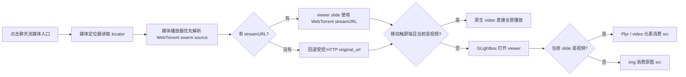

# WebTorrent 媒体查看器 source contract

- 整理日期：2026-04-12
- 结论用途：在接入 Telegram 式媒体查看器时，保住 WebTorrent “视频边下边播、图片秒开”的分发优势。

## 官方资料结论

WebTorrent 在浏览器侧的关键路径不是“拿到一个完整文件再播放”，而是：

1. 注册并等待 media service worker 激活。
2. 用 `client.createServer({ controller })` 建立浏览器内流式服务。
3. `client.add(torrentId, options, onTorrent)` 加入 torrent。
4. 从 `torrent.files` 里选择目标文件。
5. 通过 `file.streamURL` 或 `file.streamTo(video)` 把可流式读取的 URL 交给浏览器媒体元素。

参考来源：

- https://webtorrent.io/docs
- https://github.com/webtorrent/webtorrent/blob/master/docs/api.md
- https://github.com/webtorrent/webtorrent/blob/master/docs/tutorials.md

BitTorrent 的底层设计是分片下载；Web Seed 的设计是让 HTTP/FTP 源成为稳定 seed，客户端能把 HTTP seed 和 peer 拿到的 pieces 组合成同一个完整文件。落到项目里就是：HTTP anchor / web seed 是分发层后备，不是另一个业务真相。

参考来源：

- https://www.bittorrent.org/beps/bep_0003.html
- https://www.bittorrent.org/beps/bep_0019.html

## 本项目必须守住的边界

`WebTorrent` 是字节来源和协作分发运行时；`GLightbox` 是媒体查看器壳；`Plyr` 是视频播放控件。

三者的职责不能串：

- `WebTorrent` 负责 torrent、web seed、peer、service worker、stream URL、补块和会话复用。
- `GLightbox` 负责打开/关闭、左右切换、图片缩放、触摸/键盘、viewer 生命周期。
- `Plyr` 只负责当前视频 slide 里的播放体验。
- 移动触屏端点视频时，优先让原生 `<video>` 直接进入全屏；这条路径仍然消费 WebTorrent / anchor 解析出的同一个 `src`。

正确数据流：

## 移动端视频观看结论

移动端视频不应该先进入桌面 lightbox 再让用户点第二次全屏。正确交互更接近微信：用户在聊天流里触摸视频，就是“我要看视频”，优先进入系统原生全屏播放器。这样竖屏视频也能按真实比例交给系统视频层处理，不会被一个固定 `16:9` 容器硬塞出上下黑条。

实现约束：

- 原生全屏调用必须发生在点击事件同步链路里，不能等动态导入播放器库后再调用，否则浏览器可能丢失用户激活。
- iOS 类浏览器优先走 `video.webkitEnterFullscreen()`；其他支持 Fullscreen API 的浏览器走 `video.requestFullscreen()`。
- 被请求全屏的 `video` 元素必须是真实可见的全屏元素，不能先藏成 `1px` 或 `opacity: 0`，否则回退路径会变成黑屏/假全屏。
- 如果原生全屏不可用，再回退 GLightbox；回退时 Plyr 的 `ratio` 也必须来自当前视频真实 `width:height`，不能固定 `16:9`。

参考来源：

- https://web.dev/articles/media-mobile-web-video-playback
- https://developer.apple.com/documentation/webkitjs/htmlvideoelement/1633500-webkitenterfullscreen

## 不允许做的事

- 不允许 viewer 直接绕过 `解析播放结果()` 去拼 `original_url`。
- 不允许播放器库自己再发起另一套下载流程，导致 WebTorrent streamURL 被闲置。
- 不允许把“正在补块”当成用户可见故障；只要已有可播放 `src`，补块就是后台协作分发状态。
- 不允许为了播放器能力把消息列表里的 video 重新变成可播放控件；消息列表只保留入口。
- 不允许移动端视频点击后仍被固定比例的 lightbox 卡住；原生全屏是移动触屏端的优先路径。
- 不允许把 Shaka / libmedia 这类重型视频内核当成 lightbox 使用。

## 轮子选择如何落到 source contract

### GLightbox

- 用途：默认 viewer 壳。
- 要求：slide 的 `href` / `source` 必须来自 `解析播放结果()`。
- 不能做：自己根据 attachment id 拼 URL。

参考来源：

- https://github.com/biati-digital/glightbox

### Plyr

- 用途：默认视频内核候选。
- 要求：只吃当前 slide 的 `src`，这个 `src` 优先是 WebTorrent `file.streamURL`。
- 不能做：变成新的媒体定位器或下载器。

参考来源：

- https://github.com/sampotts/plyr

### Video.js / Shaka / libmedia

这些不是当前第一步：

- `Video.js` 适合 HLS / DASH、插件体系和复杂播放器平台；v10 目前是 beta。
- `Shaka Player` 适合 DASH / HLS / DRM / EME / offline，不是聊天媒体 viewer。
- `libmedia + AVPlayer` 适合 WebCodecs / Wasm / 特殊封装协议 / 自定义解码管线，但 LGPL 和 COOP / COEP 要单独审。

它们只有在“WebTorrent streamURL + HTML5 video / Plyr”无法满足播放格式或流媒体能力时，才进入隔离 POC。

## TDD 接入目标

下一步代码只做一条竖切，不扩大范围：

1. 在前端新增极薄 viewer adapter，接收已解析好的媒体展示项和起始 attachment id。
2. 测试先证明：点击视频时传给 viewer 的 src 是 `swarm` 结果，而不是裸 `originalSrc`。
3. 测试再证明：没有 swarm 时才回退 anchor。
4. 测试锁住：聊天列表 video 没有 controls，真正播放发生在 viewer。
5. 测试锁住：图片点开使用原图 URL；如果未来图片也能走 swarm，则仍从同一 source contract 进入。
